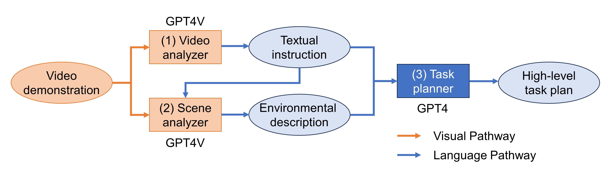

# GPT4Vision-Robot-Manipulation-Prompts
This repository provides the sample code designed to interpret human demonstration videos and convert them into high-level tasks for robots. Our [Applied Robotics Research Group](https://www.microsoft.com/en-us/research/group/applied-robotics-research/) believes that this mechanism will serve as an effective interface for humans to instruct humanoid and industrial robots, for example, through the [Learning-from-Observation](https://www.microsoft.com/en-us/research/project/interactive-learning-from-observation/) framework.
The prompts are designed for easy customization and seamless integration with existing robot control and visual recognition systems.
For more information, please visit our [project page](https://microsoft.github.io/GPT4Vision-Robot-Manipulation-Prompts/) and our paper, [GPT-4V(ision) for Robotics: Multimodal Task Planning from Human Demonstration](https://arxiv.org/abs/2311.12015).
Please note that this repository only contains the sample code for task recognition using GPT-4V. It does not include mechanisms for [incorporating user feedback](https://github.com/microsoft/ChatGPT-Robot-Manipulation-Prompts) or [classical vision systems](https://github.com/microsoft/analyzer-for-robot-teaching-demonstrations) to recognize affordances from videos. For those components, please explore other repositories we have provided.
### Overview of the pipeline:


## How to use
We have confirmed that the sample codes work with python 3.9.12 and 3.12.2
### If you use Azure OpenAI, set these environmental variables
- AZURE_OPENAI_DEPLOYMENT_NAME
- AZURE_OPENAI_ENDPOINT
- AZURE_OPENAI_API_KEY
### If you use OpenAI, set this environmental variable
- OPENAI_API_KEY

### Install dependencies
```bash
> pip install -r requirements.txt
```

### Run the sample code
```bash
python example.py sample_video/sample.mp4 --use_azure
```
We assume that the video path refers to a mp4 file of human demonstrating something. Add the --use_azure option if you use Azure OpenAI instead onf OpenAI

## Bibliography
```
@article{wake2024gpt,
  author={Wake, Naoki and Kanehira, Atsushi and Sasabuchi, Kazuhiro and Takamatsu, Jun and Ikeuchi, Katsushi},
  journal={IEEE Robotics and Automation Letters}, 
  title={GPT-4V(ision) for Robotics: Multimodal Task Planning From Human Demonstration}, 
  year={2024},
  volume={9},
  number={11},
  pages={10567--10574},
  doi={10.1109/LRA.2024.3477090}}
```

## Contributing

This project welcomes contributions and suggestions.  Most contributions require you to agree to a
Contributor License Agreement (CLA) declaring that you have the right to, and actually do, grant us
the rights to use your contribution. For details, visit https://cla.opensource.microsoft.com.

When you submit a pull request, a CLA bot will automatically determine whether you need to provide
a CLA and decorate the PR appropriately (e.g., status check, comment). Simply follow the instructions
provided by the bot. You will only need to do this once across all repos using our CLA.

This project has adopted the [Microsoft Open Source Code of Conduct](https://opensource.microsoft.com/codeofconduct/).
For more information see the [Code of Conduct FAQ](https://opensource.microsoft.com/codeofconduct/faq/) or
contact [opencode@microsoft.com](mailto:opencode@microsoft.com) with any additional questions or comments.

## Trademarks

This project may contain trademarks or logos for projects, products, or services. Authorized use of Microsoft 
trademarks or logos is subject to and must follow 
[Microsoft's Trademark & Brand Guidelines](https://www.microsoft.com/en-us/legal/intellectualproperty/trademarks/usage/general).
Use of Microsoft trademarks or logos in modified versions of this project must not cause confusion or imply Microsoft sponsorship.
Any use of third-party trademarks or logos are subject to those third-party's policies.
